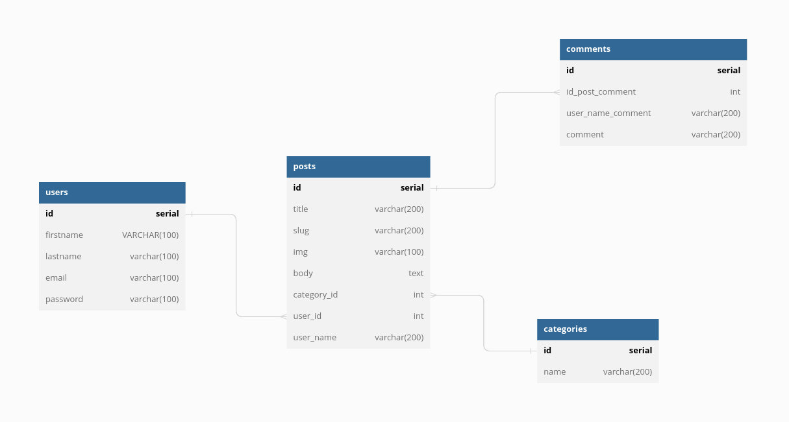

### Learning Purpose Golang, standard Lib

Package gorilla/mux implements a request router and dispatcher for matching incoming requests to their respective handler.

The name mux stands for "HTTP request multiplexer". Like the standard http.ServeMux, mux.Router matches incoming requests against a list of registered routes and calls a handler for the route that matches the URL or other conditions.

### Skema Database Mux Blog

